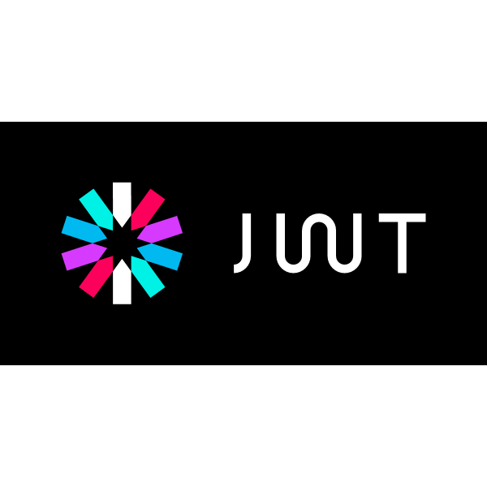

# Food Menu API

<div id="header" align="center">

  
</div>


## About the API

Study project API that store dishes and food categories information  

## Starting the server

Install the dependencies first: 

``` npm install ```

To start the main server: 

``` npm run dev ```

To start the authentication server: 

``` npm run auth ```

To run tests in development environment using jest: 

``` npm run test```

## API Documentation: 

You can access the API Documentation through this [Link](https://######) (TODO)

## Technologies used in this project


<div align="center">
 &nbsp;
  &nbsp;
 &nbsp;
 &nbsp; 
 &nbsp;
&nbsp;

</div>

  
